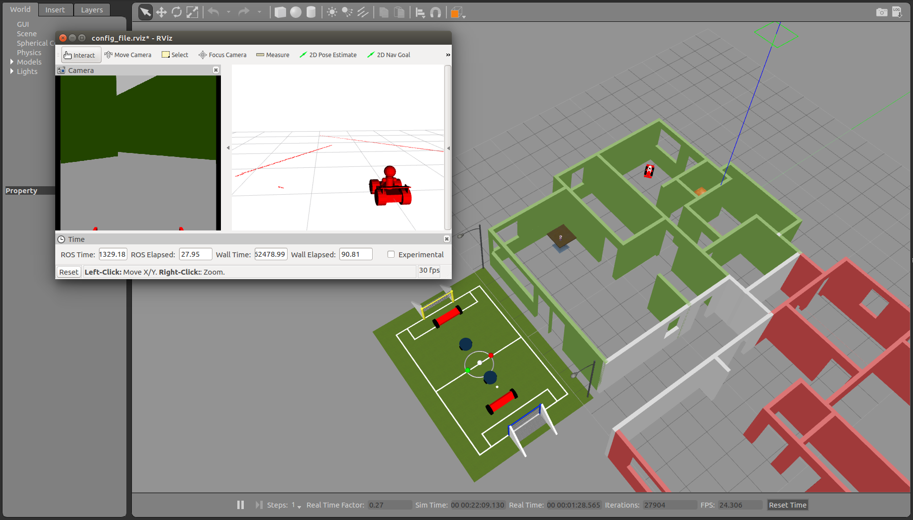
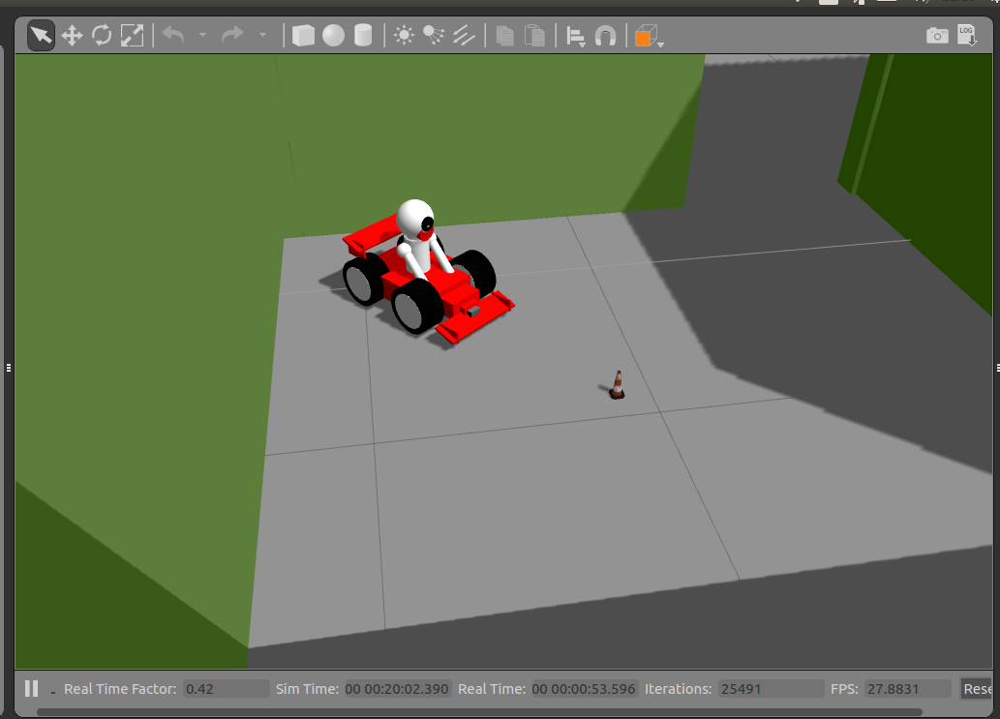
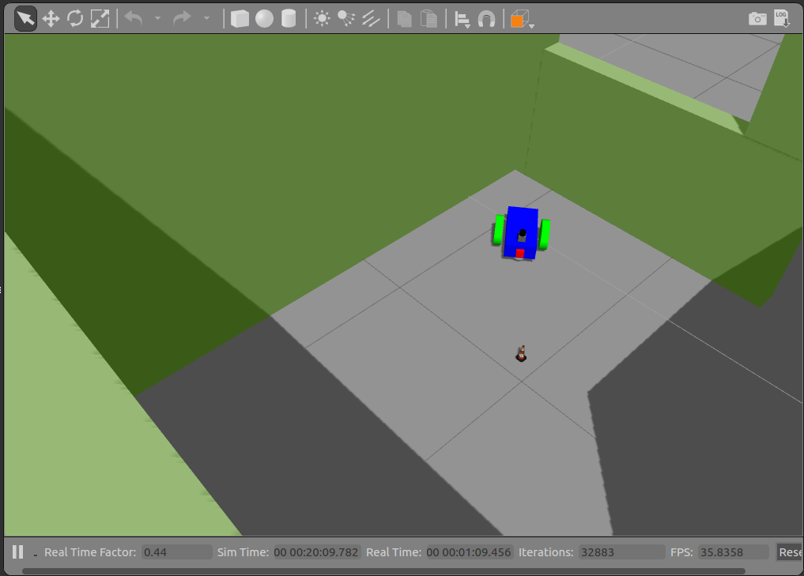

# Go Chase It Project
Project 2 of Udacity Robotics Software Engineer Nanodegree Program
In this project a differential drive robot and a skid steer robot are 
capable of chasing a white colored ball in a simulation world in Gazebo.

## Prerequisites/Dependencies
* Linux 16.04
* Gazebo >= 7.0  
* ROS Kinetic  
* make >= 4.1
* gcc/g++ >= 5.4

## Run the project
* Create a catkin workspace
```bash
mkdir -p /home/workspace/catkin_ws/src
cd /home/workspace/catkin_ws/src
catkin_init_workspace
```
* Build the catkin package
```bash
cd /home/workspace/catkin_ws
catkin_make
```
* Launch the robot inside the world
```bash
cd /home/workspace/catkin_ws
source devel/setup.bash
roslaunch my_world my_cart.launch
```
* Launch drive_bot and process_image nodes on a new terminal
```bash
cd /home/workspace/catkin_ws
source devel/setup.bash
roslaunch ball_chaser ball_chaser.launch
```
* Move the white ball (located in the center of the football field outside the appartment) in front of the robot in the gazebo world and see the see the robot chasing the ball.

## Generated world


## Skid steer ferrari


## Differential drive robot
 

## Project Description  
Directory Structure  
```
.Project2                          # Go Chase It Project
├── my_robot                       # my_robot package (differential drive)                   
│   ├── launch                     # launch folder for launch files   
│   │   ├── robot_description.launch
│   │   ├── world.launch
│   ├── meshes                     # meshes folder for sensors
│   │   ├── hokuyo.dae
│   ├── urdf                       # urdf folder for xarco files
│   │   ├── my_robot.gazebo
│   │   ├── my_robot.xacro
│   ├── CMakeLists.txt             # compiler instructions
│   ├── package.xml                # package info
├── my_cart                        # my_cart package (skid steer)                   
│   ├── launch                     # launch folder for launch files   
│   │   ├── robot_description.launch
│   │   ├── world.launch
│   ├── meshes                     # meshes folder for sensors
│   │   ├── hokuyo.dae
│   ├── urdf                       # urdf folder for xarco files
│   │   ├── my_robot.gazebo
│   │   ├── my_robot.xacro
│   ├── CMakeLists.txt             # compiler instructions
│   ├── package.xml                # package info
├── my_world                       # my_world package                   
│   ├── rviz                       # rviz folder for rviz config files
│   │   ├── config_file.rviz       # base rviz config
│   ├── models                     # models folder for world models
│   │   ├── my_ball                # white ball model
│   │   │   ├── model.config   
│   │   │   ├── model.sdf
│   ├── world                      # world folder for world files
│   │   ├── 1floorHouse.world
│   ├── launch                     # launch folder for launch files   
│   │   ├── my_cart_world.launch   # launch world with my_cart platform
│   │   ├── my_robot_world.launch  # launch world with my_robot platform
│   ├── CMakeLists.txt             # compiler instructions
│   ├── package.xml                # package info
├── ball_chaser                    # ball_chaser package                   
│   ├── launch                     # launch folder for launch files   
│   │   ├── ball_chaser.launch
│   ├── src                        # source folder for C++ scripts
│   │   ├── drive_bot.cpp
│   │   ├── process_images.cpp
│   ├── srv                        # service folder for ROS services
│   │   ├── DriveToTarget.srv
│   ├── CMakeLists.txt             # compiler instructions
│   ├── package.xml                # package info                  
└──           
```
