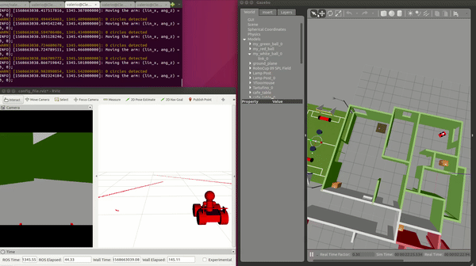
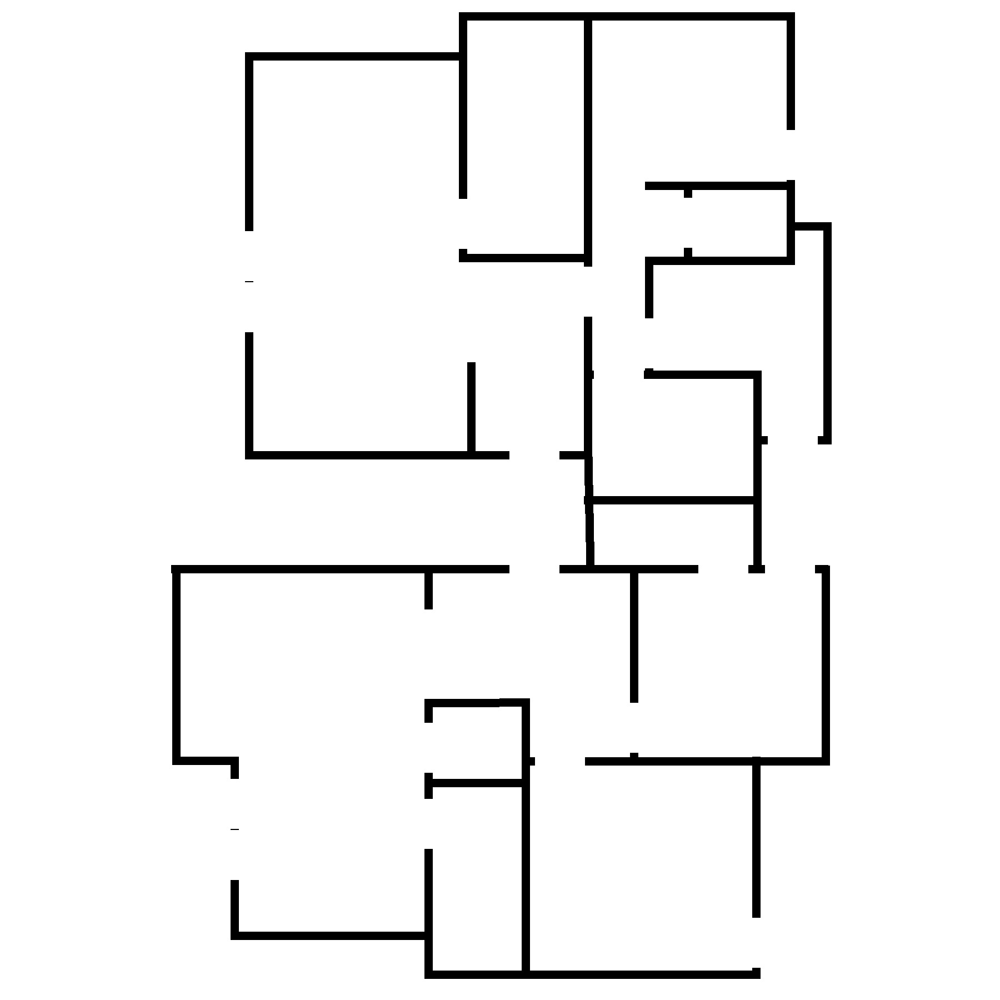

# Where am I Project
Project 2 of Udacity Robotics Software Engineer Nanodegree Program
In this project a a skid steer robot given the floor map is capable of localizing with the AMCL package using odometers and a hokuyo laser scanner in a simulation world in Gazebo.

## Prerequisites/Dependencies
* Linux 16.04
* Gazebo >= 7.16
* ROS Kinetic  
* ros-kinetic-navigation 
* ros-kinetic-map-server 
* ros-kinetic-move-base
* ros-kinetic-amcl
* make >= 4.1
* gcc/g++ >= 5.4

## Run the project
* Clone the repository
```bash
mkdir -p /home/workspace/catkin_ws/
cd /home/workspace/catkin_ws/
git clone https://github.com/ValerioMa/RoboND-WhereAmI-Project.git
```
* Init the catkin workspace
```bash
cd /home/workspace/catkin_ws/src
catkin_init_workspace
```
* Build the catkin package
```bash
cd /home/workspace/catkin_ws
catkin_make
```
* Launch the gazebo simulation
On 4 different terminal launch:
  * Gazebo simulator
  ```bash
  cd /home/workspace/catkin_ws
  source devel/setup.bash
  roslaunch my_world my_cart_world.launch 
  ```
  * Amcl localization
  ```bash
  cd /home/workspace/catkin_ws
  source devel/setup.bash
  roslaunch udacity_bot amcl.launch
  ```
  * Load static map
  ```bash
  cd /home/workspace/catkin_ws
  source devel/setup.bash
  roslaunch udacity_bot map_server.launch
  ```
  * Planning and control
  ```bash
  cd /home/workspace/catkin_ws
  source devel/setup.bash
  roslaunch udacity_bot move.launch
  ```


The robot can be controlled using the "2D Nav Goal" button at the top of Rviz.
The robot will move to the position you click. During the motion the localization filter will converge around the robot true position.
```bash   
rosrun teleop_twist_keyboard teleop_twist_keyboard.py
```

## Demo




## map_creator Submodule
This submodule can be used to extract the pgm occupancy grid map of the gazebo world. That can be used to localize the robot with the AMCL fitler.