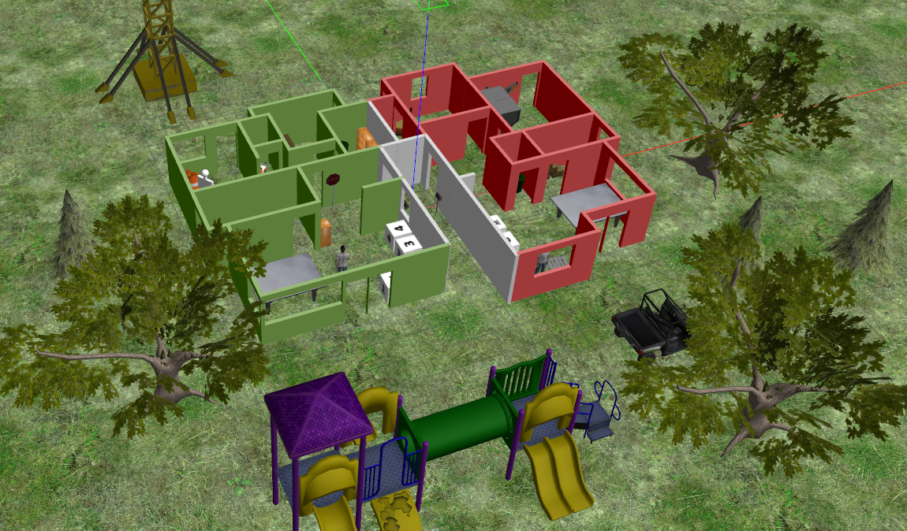
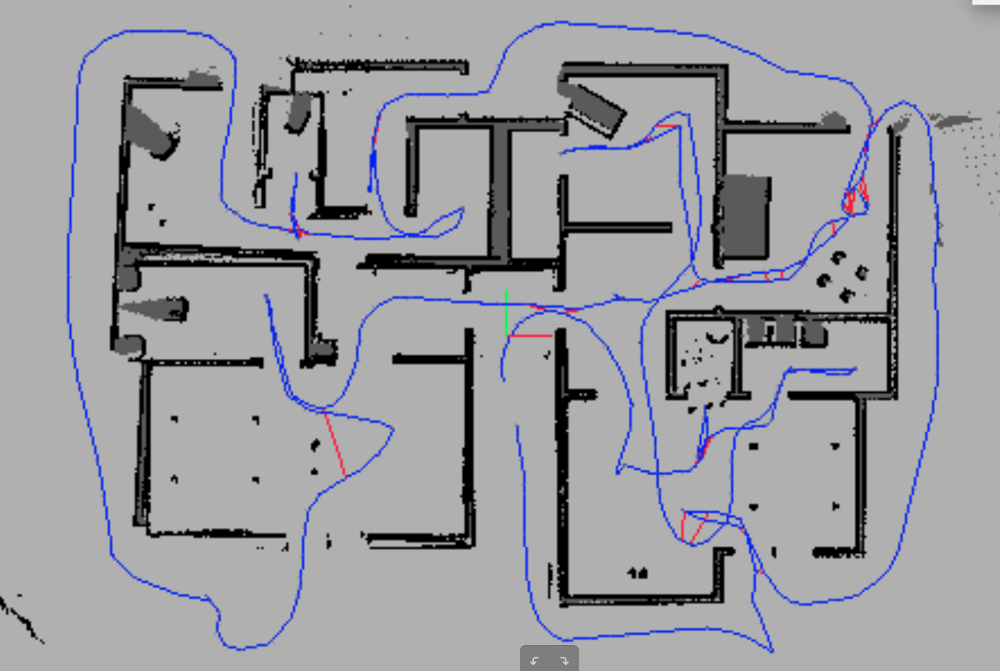
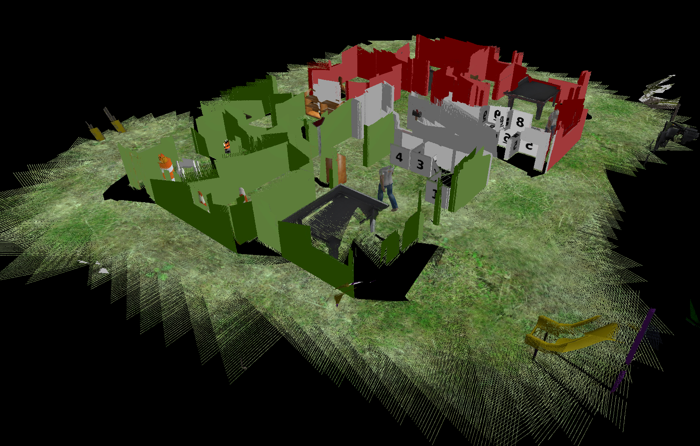

# Where am I Project
Project 3 of Udacity Robotics Software Engineer Nanodegree Program
In this project a a skid steer robot is capable of mapping a floor plan
using the RTAB-Map in a simulation world in Gazebo.
## Prerequisites/Dependencies
* Linux 16.04
* Gazebo >= 7.16
* ROS Kinetic  
* ros-kinetic-navigation 
* ros-kinetic-map-server 
* ros-kinetic-move-base
* ros-kinetic-amcl
* make >= 4.1
* gcc/g++ >= 5.4

## SLAM
* Clone the repository
```bash
mkdir -p /home/workspace/catkin_ws/
cd /home/workspace/catkin_ws/
git clone https://github.com/ValerioMa/RoboND-MapMyWorld.git src
```
* Init the catkin workspace
```bash
cd /home/workspace/catkin_ws/src
catkin_init_workspace
```
* Build the catkin package
```bash
cd /home/workspace/catkin_ws
catkin_make
```
* Launch the mapping process
On 4 different terminal launch:
  * Gazebo simulator
  ```bash
  cd /home/workspace/catkin_ws
  source devel/setup.bash
  roslaunch my_world my_cart_world.launch 
  ```
  * Launch mapping packages
  ```bash
  cd /home/workspace/catkin_ws
  source devel/setup.bash
  roslaunch udacity_bot mapping.launch
  ```
  * Teleoperate the robot using a xbox joypad
  ```bash
  cd /home/workspace/catkin_ws
  source devel/setup.bash
  roslaunch udacity_bot joy_teleop.launch
  ```

### Mapping results
Gazebo world and reconstructed occupancy grid map and 3D mesh
<p float="center">
  
   
  
</p>
